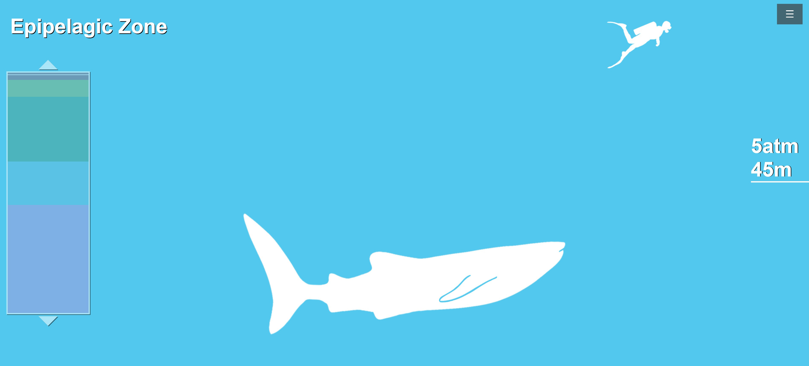

# Ocean Zone Explorer

## Overview

This ocean zone diagram was build using HTML, CSS, and JavaScript.  The user can skip to various depths by clicking on the map on the left side of the screen.  A depth gauge changes based on how far the user scrolls down. The user can change the units and disable the map by clicking on the menu in the top right.

